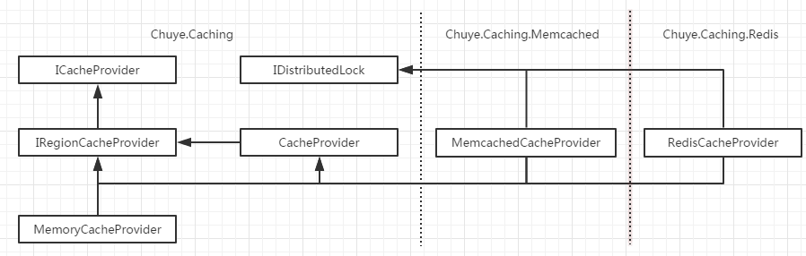

# Chuye.Caching
.Net cache solution implemented for memcached using EnyimMemcached, for redis using StackExchange.Redis

## Architecture



## Usage

### HttpRuntimeCacheProvider

```c
    IHttpRuntimeCacheProvider cacheProvider 
        = new HttpRuntimeCacheProvider();
        // MemcachedCacheProvider.Default;                     //using memcached, load from configuration
        // new RedisCacheProvider(StackExchangeRedis.Default)  //using redis, load from configuration
    var exist = cacheProvider.TryGet<Object>(key, out val);
    Assert.IsFalse(exist);
    Assert.AreEqual(val, null);

    cacheProvider.Overwrite(key, val);
    exist = cacheProvider.TryGet<Object>(key, out val);
    Assert.IsNull(val);
```

### Dependency injection

```c
// prepare
{
    var builder = new ContainerBuilder();
    builder.Register(_ => new HttpRuntimeCacheProvider())
        //.Register(_ => MemcachedCacheProvider.Default) //use memcached from config
        //.Register(_ => new RedisCacheProvider(StackExchangeRedis.Default)) //use redis from config
        .As<IRegionHttpRuntimeCacheProvider>();
    
    var container = builder.Build();
}

// concreate
{
    private readonly IRegionHttpRuntimeCacheProvider _userCache;
    private readonly IRegionHttpRuntimeCacheProvider _loginCache;

    public SomeController(IRegionHttpRuntimeCacheProvider cacheProvider) {
        _userCache = cacheProvider.Switch("user");
        _loginCache = cacheProvider.Switch("login");
    }
}

```


More detail in [HttpRuntimeCacheProviderTest](src/Chuye.Caching.Tests/HttpRuntimeCache/HttpRuntimeCacheProviderTest.cs)

### DistributedLock

```c
    IDistributedLock cache 
        = MemcachedCacheProvider.Default; 
        //= new RedisCacheProvider(StackExchangeRedis.Default);   //U could using redis directly though
    var key = "DistributedLock";

    var list = new List<int>();
    var except = new Random().Next(1000, 2000);
    var stopwatch = Stopwatch.StartNew();

    Parallel.For(0, except, i => {
        using (cache.ReleasableLock(key)) {
            list.Add(i);
        }
    });

    stopwatch.Stop();
    Console.WriteLine("Handle {0} times cost {1}, {2:f2} per sec.",
        except, stopwatch.Elapsed.TotalSeconds, except / stopwatch.Elapsed.TotalSeconds);

    Assert.AreEqual(list.Count, except);
```

More detail in [MemcachedCacheProviderTest](src/Chuye.Caching.Tests/Memcached/MemcachedCacheProviderTest.cs)
  or [RedisCacheProviderTest](src/Chuye.Caching.Tests/Redis/RedisCacheProviderTest.cs)
  
  
## Release log

### 2.4 添加基于配置的扩展能力

* Memcached 和 Redis 的 CacheProvider 加入对所有或特定 Region 实施只读策略的能力;
* 缓存路径即 region+key 的拼接方式可以通过配置修改，以方便迁移；
* 在没有显式指示缓存时间时，可以使用配置中的默认过期时间;
* 可以通过切换 region 生成新的实例以满足依赖注入的需求

### 2.3  简化 api 接口

* 修复 Memcached 分布式锁未正确释放的问题;
  